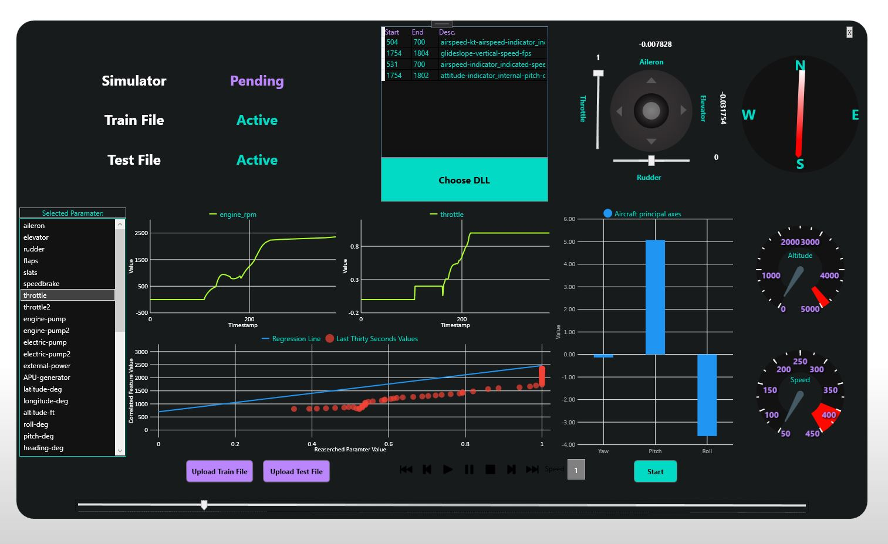
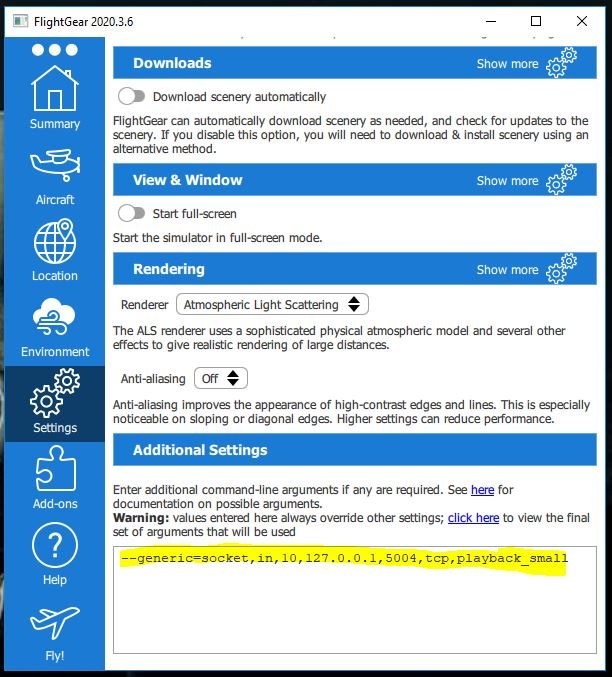

# FlightSimulator


## Main objectives:
1. Using .Net Framework to create a GUI application for flight simulation.
2. Implementing the project using mvvm architecture.
## Summary
"FlightSimulator" is a tool for analyzing and researching a given flight report using two displays:
- Simulation display - displaying animation through FlightGear.
- Analyzing display - displaying updating information about different kinds of flight parameters according to the user's choice.
## Application Features:
1. Controllable timeline.
2. Adjustable animation Speed.
3. Altitude gauge.
4. Speed gauge.
5. Flight's direction.
6. Plane Control Wheel (Yoke).
7. Principal axes (Yaw,Pitch, Roll)
8. Selection of a specific flight parameter for research.
9. Updating Data About The Selected Flight Parameter:
	- It's value.
	- The most correlated flight parameter value.
	- Regression line of the two parameters. (the other being the correlated parameter)
	- last thirty seconds values of the two parameters.
10. Anomaly detection algorithm chosen by the user.
11. Anomalies information (when, where, which parameters)




## Folder Structure
```
.Milestone_1
├── FlightSimulator               
|   ├── Helper          	      # Calculation and parsing classes.
|   ├── Model         		      # Model part of the mvvm architecture.
|   |   ├── DataModel.cs	      # The central model of the UI
|   |   ├── DLLModel.cs		      # Model of the anomalies detection algorithms.
|   |   ├── SocketModel.cs	      # Model for the communication with FlightGear.
|   ├── Properties     		      # Generated setting for the project.
|   ├── View         		      # View part of the mvvm - different displays in the project.
|   |   ├── ...			      # The different components of the view part(time bar, graphs, gauges etc..) of the mvvm.
|   ├── ViewModel         	      # ViewModel for each of the different views in the project. 
|   |   ├── ...			      # Corresponding view model for each of the different views.
|   ├── public         		      # icons and pictures used.
|   ├── packages.config		      # config file for needed packages.
|   ├── App.xml			      # Settings for some of the view components.
├── packages		              # Packages used in the project. 
├── plugins			      # Folder for the anomaly detection algorithms (dll files).

```

## Requirements
- x64 Windows compatible machine.
- Visual Studio 2019 installed.
- FlightFear 2020.3.8 (For windows 7,8,10)
## Compiling and Running
1. Clone/download this repo.
2. open "FlightSimulator.sln" in Visual studio and build the project. (This will download the required packages - specified in "packages.config" file, see above in "Folder Structure").
3. Download [FlightGear](https://sourceforge.net/projects/flightgear/files/release-2020.3/FlightGear-3020.3.8.exe/download)
4. Configure FlightGear setting as shown below. (see the highlight section)
5. Click on the "fly" Icon to run FlightGear with the correct setting you've set in the previous step.
6. Run the FlightSimulator app (from visual studio or the .exe file in FlightSimulator/bin/Debug/FlightSimulator.exe), make sure it's x64.




## Additional Links
- [Project's UML  diagram.](https://github.com/Eli-s-Dream-TEam/Milestone_1/blob/main/UMLDiagram.pdf)
- [Short instructional video about the project.](https://www.youtube.com/watch?v=OkbNiaYKxJ4)


## Importing a new anomaly detector (DLL)

Provided below is the DLL's interface, wrap your anomaly detector in a DLL provider and export the following methods (`C` compatible)

### Instructions

1) Each method below, excluding the Wrapper object, should be exported using `extern "C" __declspec(dllexport)`.
2) Compile to support x64.
3) If you are using `.NET`, make sure to include `pch.h` at the ***TOP*** of each used file.
4) If you are using `.NET`, make sure `pch.h` is clean of imports (excluding `framework.h`)

### Wrapper
```
class Wrapper {
	vector<AnomalyReport> ve;
	
public:
	// Get the size of the anomaly report vector
	int size();
	// Get description of the anomaly at [index]
	const char* getDescriptionByIndex(double index)
	// Get timestamp of the anomaly at [index]
	int getTimestampByIndex(double index);
	
}
```

### Methods

```
/**
* @param train (path to train file)
* @param test (path to test file)
* @returns pointer to Wrapper, to be converted to IntPtr in C#
*/
void *learn(const char* train, const char* test)
```

```
/**
* @param *wrapper (pointer to wrapper object)
* returns the anomaly-report vector's size.
*/
int vectorSize(Wrapper *wrapper);
```

```
/**
* @param *wrapper (pointer to wrapper object)
* @param index (index of the requested string)
* @returns string at the index, with the Wrapper's method.
*/
const char* getStringByIndex(Wrapper *wrapper, double index);
```

```
/**
* @param *wrapper (pointer to wrapper object)
* @param index (index of the requested timestamp)
* @returns timestamp at the index, with the Wrapper's method.
*/
const char* getTimestampByIndex(Wrapper *wrapper, double index);
```

